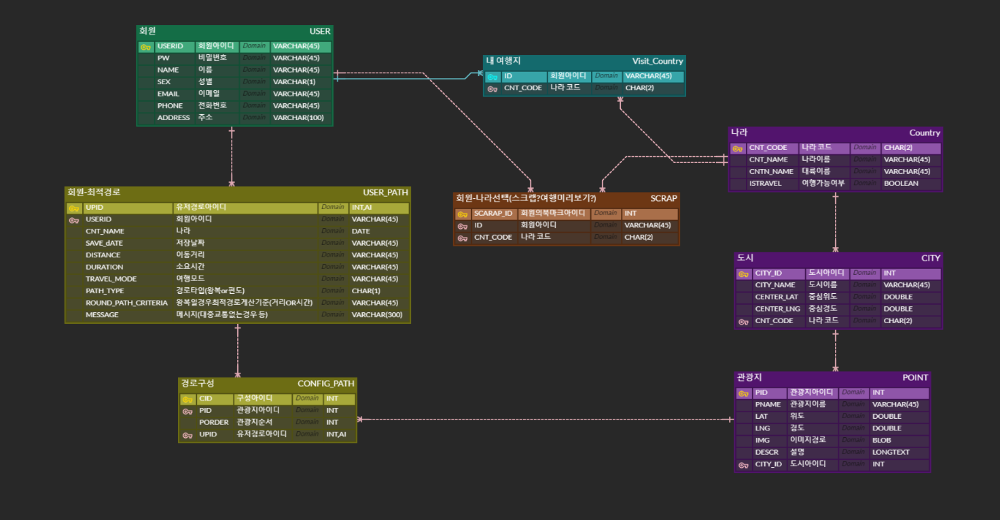
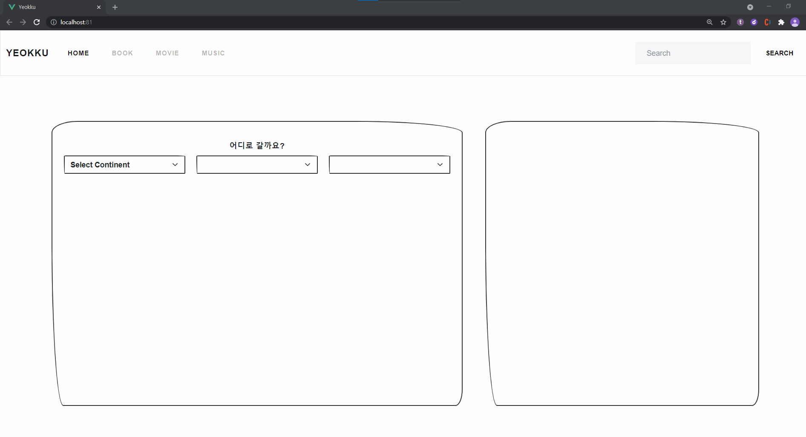
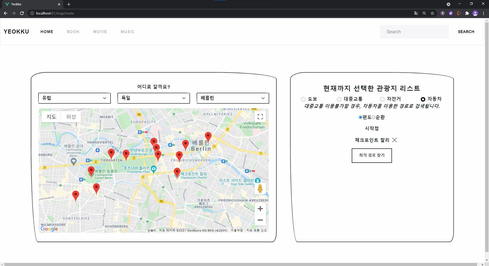
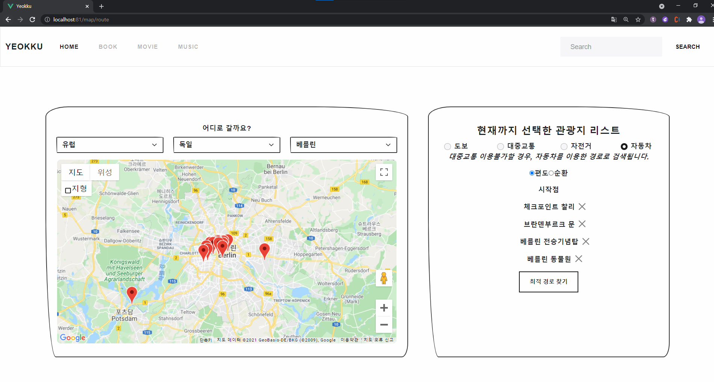
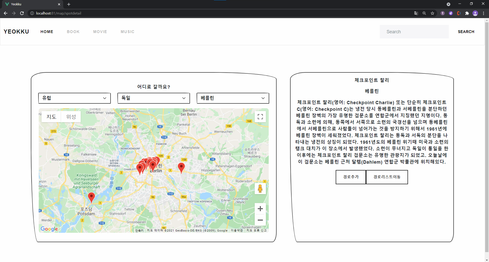
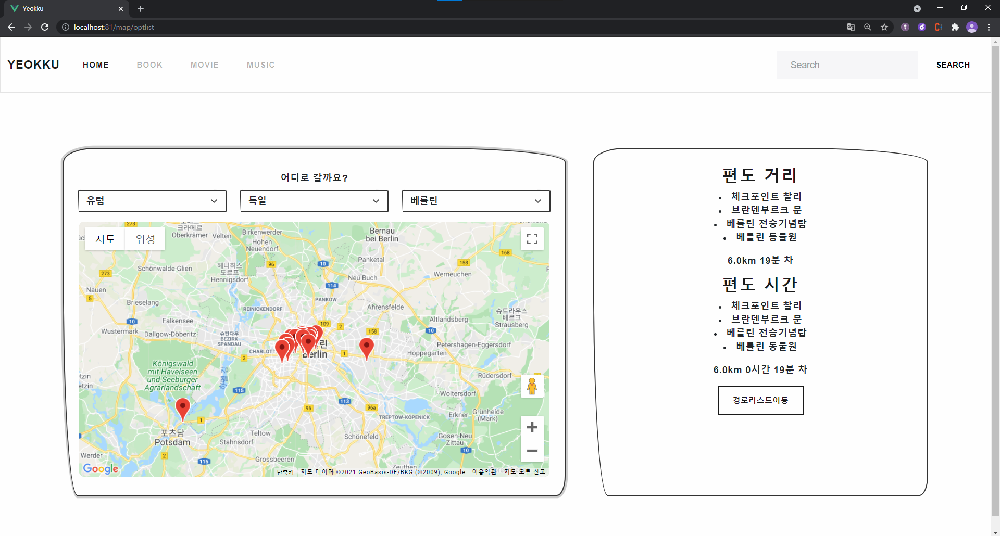
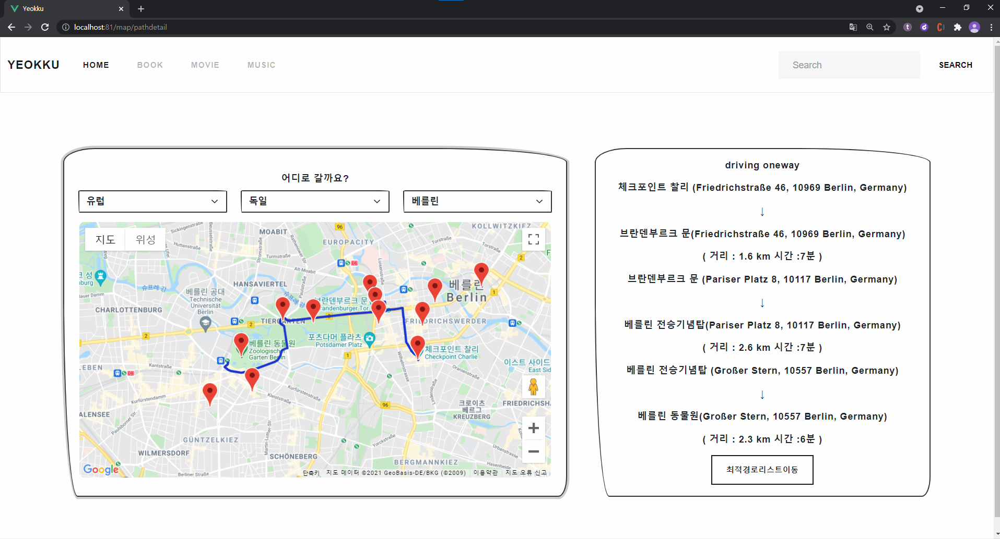
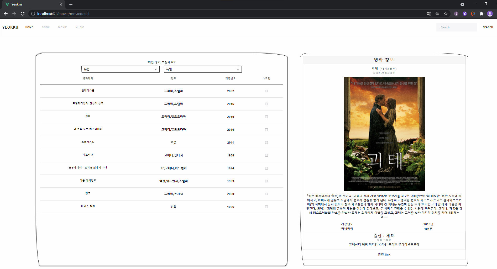
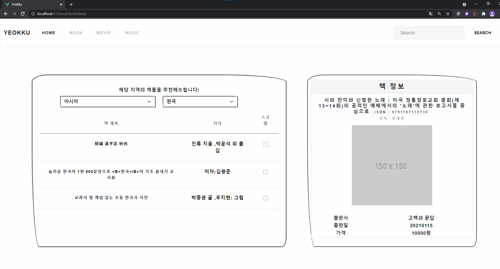

# YEOKKU
인상적인 여행경험 공유를 위한 웹서비스

## Project Summary

- 제안 배경

  코로나 백신 접종 이후, 새로운 여행에 대한 기대감으로 인한 해외여행 선 예약 폭주, '얼리 항공권' 일품 현상 등 여행대기수요 급증하고 있다.

  여행가기 전, 여행지를 고르고, **여행루트**도 고민하지만. 더 나아가 여행에 대한 기대를 고조시키기 위해 관련된 **책, 영화, 음악**을 각 나라의 지역마다 확인할 수 있는 웹서비스 제공 

- 타겟

  MZ세대를 타겟으로 하여 심플하고 귀여운 UI를 제공한다.

## Tech Stack

#### 개발 환경

- Backend : Spring MVC, MyBatis, Mysql 

- Frontend : Vue.js, Vuex

- API

  책 - 국립중앙도서관 API  이용

  음악 - SPOTIFY CHART 크롤링

  영화 - KMDB API 이용

  길찾기 - google place api, google distance api 이용

  관광지 데이터 -  위키백과 나라별 도시별 관광지 크롤링

#### DB 모델링 

  

#### 최적경로알고리즘

- 순환 

  **외판원 순회 알고리즘(TSP : Traveling Salesperson Problem)** 

  여러 도시들이 있을 때, 특정 도시에서 도시로 이동할 때 드는 비용이 주어졌을 때, 불특정한 도시에서 출발해 모든 도시를 돌고 다시 출발 도시로 돌아왔을 때 드는 최소비용

- 편도

  **다익스트라 알고리즘(*Dijkstra algorithm*)**

  특정한 하나의 정점에서 다른 모든 정점으로 가는 최단 경로

## Pages in Detail

#### 메인 페이지

   
    
#### 특정 나라에 지역 선택시 관광지 리스트
  
   
   
  
  
#### 여행지 선택시 구체정보

  

#### 최적 경로 제공
  
   1. 가고 싶은 관광지 3개 이상을 경로에 추가

      시간 및 거리를 기준으로 한 눈에 지도에서 가야하는 루트의 polyline 표시

   2. 선택된 관광지들을 기준으로 교통수단, 순환/비순환 옵션 선택

      교통수단일 경우, 지하철, 버스 등의 교통정보 제공

   3. 최적경로 버튼 클릭
  
  
  
  
  **<핵심 구현 기술>**
  - 구글 지오코딩 API를 이용해 여행지의 위도, 경도 정보 저장
  - 구글 distance Matrix API를 이용해 여행지간 이동거리와 소요시간 인접행렬 구성
  - 여러 여행지를 선택하고 시작점을 정하면 앞서 구성한 인접행렬과 외판원순회 또는 다익스트라 알고리즘을 이용해
    최소시간, 최소이동거리를 만족하는 최적 여행 경로 구성
  - 구글 direction API를 이용해 각 구간별 상세 길찾기 정보 제공
  

#### 해당 나라에서 찍은 영화정보

  

#### 해당 국가에서 많이 듣는 음악차트 Top100 

  

#### 해당 나라 관련 책 정보

   

